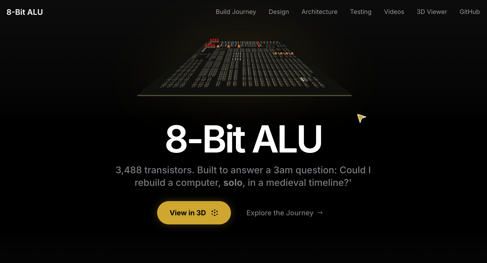
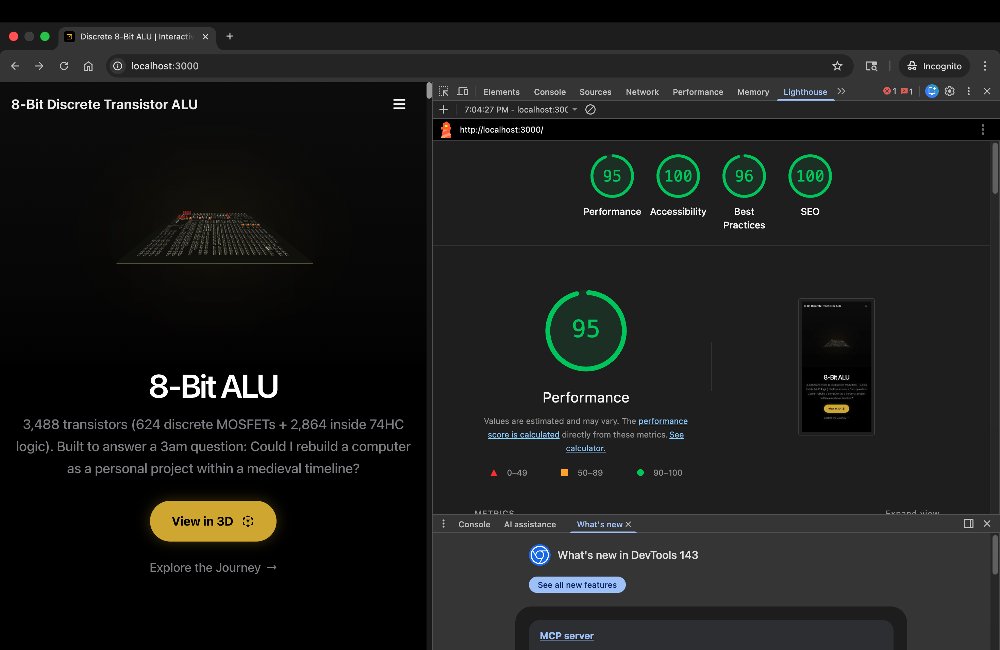

# 8-Bit Discrete Transistor ALU — Interactive Digital Twin

[](https://nextjs.org/)
[](https://www.typescriptlang.org/)
[](https://docs.pmnd.rs/react-three-fiber)
[](https://tailwindcss.com/)
[](LICENSE)

> **Documentation & Interactive Layer** for the [8-Bit Discrete Transistor ALU](https://github.com/tmarhguy/8bit-discrete-transistor-alu) hardware project.

**Live Site:** [alu.tmarhguy.com](https://alu.tmarhguy.com)



## Core Project Context

This repository serves as the **Digital Twin** for a physical CPU constructed using **3,488 transistors**. It bridges the gap between hardware engineering and software visualization, providing a high-fidelity, interactive 3D exploration of the physical hardware.

**Hardware Stats (v1.0):**
- **Total Transistors:** 3,488 (624 discrete MOSFETs + 2,864 in 74HC series ICs)
- **Discrete Logic:** Inverters, NAND, NOR, XOR gates hand-wired on custom PCBs.
- **Architectural Placeholders:** 74HC157 multiplexers and 74HC86 XOR gates currently utilized to validate architecture (Migration to fully discrete logic planned for v2.0).
- **Verification:** Exhaustive 1,245,184 test vectors validated via Verilog simulation and physical hardware testing.

For detailed hardware documentation, schematics, and SPICE simulations, refer to the [main hardware repository](https://github.com/tmarhguy/8bit-discrete-transistor-alu).

---

## Cinematic Visualization Engine

To visualize the hardware's complexity, this project implements a bespoke cinematic camera system capable of industry-standard motion control within the browser.

### Parametric Path Generation
The camera system eschews pre-baked animations in favor of real-time parametric path generation.
- **Catmull-Rom Splines:** Utilizes centripetal parameterization to ensure smooth curves through keyframes without spatial overshoot.
- **Unified Velocity Control:** Implements arc-length re-parameterization to decouple camera speed from control point density, ensuring consistent movement velocity across varied geometric paths.

### Temporal Stability
The rendering loop is decoupled from the camera logic to ensure frame-rate independence.
- **Micro-Jitter Elimination:** Applies exponential smoothing (low-pass filtering) to camera position and look-at targets, eliminating high-frequency noise during frame drops.
- **C1 Continuity:** Enforces geometric continuity at scene transitions to prevent velocity discontinuities (jerks) between camera cuts.

## Adaptive Rendering Architecture

The application targets a consistent 60 FPS across devices ranging from high-end workstations to mobile phones through an adaptive quality system.

### Hardware Tiering
On initialization, the application profiles the client environment (CPU concurrency, GPU class, device pixel ratio) to assign a performance tier:
- **High:** Full resolution (DPR 2.0+), contact shadows, high-precision lighting, antialiasing.
- **Medium:** Optimized resolution (DPR 1.5), standard shadows, balanced lighting.
- **Low:** Native resolution (DPR 1.0), baked lighting only, simplified shaders.

### Dynamic Optimization
- **Power Preference:** Automatically adjusts WebGL power preference and frameloop strategies (`always` vs `demand`) to respect battery constraints on mobile devices.
- **Progressive Loading:** Geometry uses `Suspense` boundaries for progressive streaming, prioritizing the ALU board visibility before secondary scene elements.

## System Architecture & Asset Pipeline

The project adheres to a "Zero-Dependency" architecture for long-term sustainability and performance.

### 1. Self-Hosted Asset Pipeline
All media assets are version-controlled and served directly from the repository, eliminating reliance on external CDNs or SaaS providers.
- **Local Source of Truth:** Images and 4K video assets are stored in `/public/media/`, ensuring the repository is self-contained.
- **Next.js Image Optimization:** Automatic format conversion (WebP/AVIF) and size optimization handled at build time.
- **Edge Caching:** Assets are distributed via Vercel's global edge network for sub-second latency.

### 2. 3D Optimization Workflow
Rendering 3,000+ individual components requires aggressive geometry optimization:
- **Draco Compression:** Raw CAD exports (`.step`) are converted to GLTF and compressed, reducing geometry size by ~90% (50MB+ → <5MB).
- **Instanced Rendering:** Identical components (transistors, LEDs, resistors) utilize geometry instancing to reduce draw calls from thousands to <50 per frame.

## Performance Metrics

| Platform | Performance | Accessibility | Best Practices | SEO |
|----------|-------------|---------------|----------------|-----|
| **Desktop** | 100 | 100 | 96 | 100 |
| **Mobile** | 95 | 100 | 95 | 100 |

*Scores validated via Chrome DevTools Lighthouse.*

<div align="center">
  
  
</div>

## Tech Stack

### Frontend Core

- **Framework:** [Next.js 14](https://nextjs.org/) (App Router) - SSG for optimal SEO.
- **Language:** **TypeScript 5** - Strict type safety.
- **Styling:** **Tailwind CSS 3** - Utility-first styling.
- **Motion:** [Framer Motion](https://www.framer.com/motion/) - Complex UI transitions and text reveals.
- **Icons:** [Lucide React](https://lucide.dev/) - Consistent, lightweight icon set.

### Interactive 3D

- **Engine:** **Three.js** via [React Three Fiber](https://docs.pmnd.rs/react-three-fiber).
- **Controls:** Custom camera implementation extending `@react-three/drei`.
- **Asset Pipeline:** Draco Compression (GLTF) for 90% geometry reduction.

### Infrastructure & Telemetry

- **Hosting:** Vercel Edge Network.
- **Analytics:** [Vercel Analytics](https://vercel.com/analytics) - Privacy-friendly real-time traffic insights.
- **Media:** Self-hosted (Zero runtime dependencies; Cloudinary used only for build-time optimization scripts).

## Local Development

1.  **Clone the Repository**
    ```bash
    git clone https://github.com/tmarhguy/alu-website.git
    cd alu-website
    ```

2.  **Install Dependencies**
    ```bash
    npm install
    ```

3.  **Run Development Server**
    ```bash
    npm run dev
    ```
    Visit [http://localhost:3000](http://localhost:3000).

## Related Resources

- **[TRANSISTOR_COUNT_REPORT.md](TRANSISTOR_COUNT_REPORT.md)**: Detailed inventory of the 3,488 transistors.
- **[Hardware Source Code](https://github.com/tmarhguy/8bit-discrete-transistor-alu)**: KiCad files, SPICE simulations, and Verilog verification.
- **[Live Portfolio](https://tmarhguy.com)**: Other engineering projects.

## Contact

- **Email**: [tmarhguy@gmail.com](mailto:tmarhguy@gmail.com)
- **Portfolio**: [tmarhguy.com](https://tmarhguy.com)
- **LinkedIn**: [Tyrone Marhguy](https://linkedin.com/in/tmarhguy)
- **Twitter**: [@marhguy_tyrone](https://twitter.com/marhguy_tyrone)
- **Substack**: [tmarhguy.substack.com](https://tmarhguy.substack.com)

---

**Built by Tyrone Marhguy** | Computer Engineering, University of Pennsylvania
