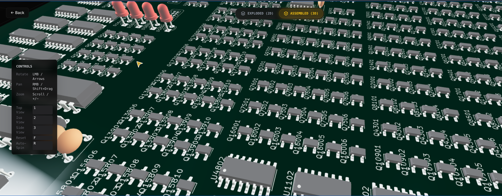
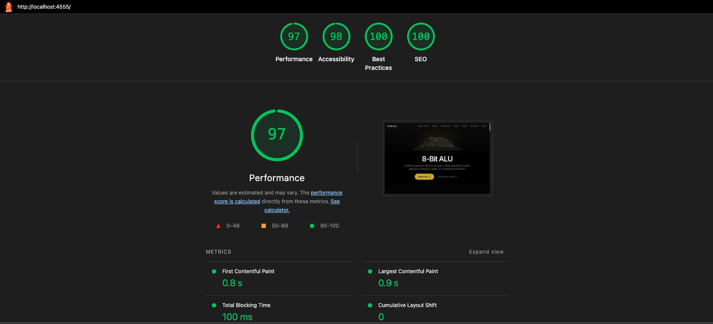

# 8-Bit Discrete Transistor ALU — Interactive Digital Twin

[](https://nextjs.org/)
[](https://www.typescriptlang.org/)
[](https://docs.pmnd.rs/react-three-fiber)
[](https://tailwindcss.com/)
[](LICENSE)

> **Documentation & Interactive Layer** for the [8-Bit Discrete Transistor ALU](https://github.com/tmarhguy/8bit-discrete-transistor-alu) hardware project.

**Live Site:** [alu.tmarhguy.com](https://alu.tmarhguy.com)


## The Core Project: Hardware First

**Important Context**: This repository is the *software companion* to a massive hardware engineering undertaking. It is not a standalone web experiment; it is the **Digital Twin** for a physical CPU I built from scratch using **3,488 individual transistors**.

While the [main hardware repository](https://github.com/tmarhguy/8bit-discrete-transistor-alu) documents the electrical engineering—KiCad schematics, SPICE simulations, and Verilog verification—this project solves a different problem: **How do you showcase a complex physical machine to a global audience?**

This platform bridges the gap between hardware and software, offering a high-performance, interactive 3D exploration of the physical ALU.

---

## System Architecture & Asset Pipeline

To deliver a cinematic experience (4K video, high-fidelity 3D models) without compromising web performance (Lighthouse 97/100), we engineered a custom asset pipeline associated with this repo.

### 1. Self-Hosted Asset Management

All media assets are version-controlled and self-hosted for complete independence:

* **Local Storage**: Images and videos are stored in `/public/media/` for zero external dependencies.
* **Next.js Optimization**: Automatic WebP/AVIF conversion, responsive sizing, and quality optimization handled by Next.js Image component.
* **CDN Distribution**: Assets are automatically cached and distributed via Vercel's global edge network.
* **Performance**: Eliminates external API latency while maintaining sub-second load times globally.

### 2. The 3D Optimization Workflow

The centerpiece "Digital Twin" is a 1:1 render of the physical PCB. Rendering 3,000+ components in a browser required aggressive optimization:

* **Draco Compression**: Raw CAD files (`.step`) from KiCad are converted to GLTF and compressed using Draco geometry compression, reducing file size from **50MB+** to **<5MB**.
* **Instancing & Geometry Sharing**: We utilize material cloning and geometry sharing methods in `React Three Fiber` to keep draw calls low, even when rendering thousands of transistors.
* **Progressive Loading**: Models use `Suspense` boundaries to load progressively, ensuring the UI remains responsive even on mobile networks.



## Tech Stack

### Frontend Core

* **Framework**: [Next.js 14](https://nextjs.org/) (App Router) - Selected for its robust **Static Site Generation (SSG)** capabilities, crucial for documentation SEO and performance.
* **Language**: **TypeScript** - 100% strict type safety to mirror the rigor of the hardware verification.
* **Styling**: **Tailwind CSS** - Utility-first structure allowing for rapid, consistent UI iteration.

### Interactive 3D

* **Engine**: **Three.js** via [React Three Fiber](https://docs.pmnd.rs/react-three-fiber).
* **Abstractions**: `@react-three/drei` for camera controls (`OrbitControls`), environment mapping, and model loading utilities.

### Performance

* **RSC (React Server Components)**: We move as much logic to the server as possible, keeping the client bundle lean.
* **Dynamic Imports**: Heavy components (like the 3D Viewer) are lazy-loaded to prioritize First Contentful Paint (FCP).




## Local Development

To run this documentation suite locally:

1.  **Clone the Repository**
    ```bash
    git clone https://github.com/tmarhguy/alu-website.git
    cd alu-website
    ```

2.  **Install Dependencies**
    ```bash
    npm install
    ```

3.  **Run Development Server**
    ```bash
    npm run dev
    ```
    Visit [http://localhost:3000](http://localhost:3000).

## Verification

This project runs a strict CI/CD pipeline:
* **Lighthouse CI**: Enforces performance budgets (Performance > 90).
* **Type Check**: `tsc --noEmit` runs on every commit.

## Related Resources

* **[TRANSISTOR_COUNT_REPORT.md](TRANSISTOR_COUNT_REPORT.md)**: A detailed breakdown of the 3,488 transistors, categorizing them by 74xx ICs vs discrete logic.
* **[Hardware Source Code](https://github.com/tmarhguy/8bit-discrete-transistor-alu)**: The 3,488 transistors, KiCad files, and Verilog.
* **[Live Portfolio](https://tmarhguy.com)**: More of my engineering work.

## Contact

* **Email**: [tmarhguy@gmail.com](mailto:tmarhguy@gmail.com)
* **Portfolio**: [tmarhguy.com](https://tmarhguy.com)
* **LinkedIn**: [Tyrone Marhguy](https://linkedin.com/in/tmarhguy)
* **Twitter**: [@marhguy_tyrone](https://twitter.com/marhguy_tyrone)
* **Substack**: [tmarhguy.substack.com](https://tmarhguy.substack.com)

---

**Built by Tyrone Marhguy** | Computer Engineering, University of Pennsylvania
